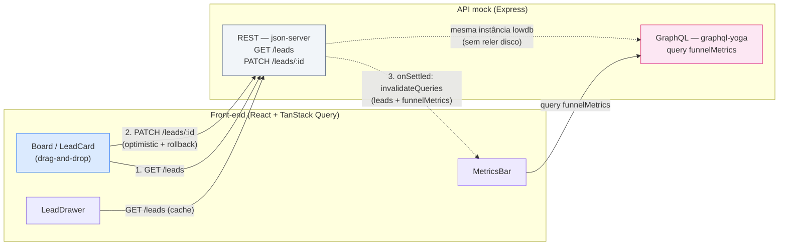

# Mini CRM — Funil de Leads (Kanban)

> O painel que o time de vendas usaria para gerenciar os leads que a landing capta.

[](https://react.dev)
[](https://www.typescriptlang.org/)
[](https://vite.dev)
[](https://tanstack.com/query)
[](https://the-guild.dev/graphql/yoga-server)

Kanban de leads jurídicos com **drag-and-drop acessível e otimista**, **métricas agregadas via GraphQL** e **filtros persistidos na URL**. Projeto de portfólio construído para simular um produto interno real, incluindo os caminhos infelizes (erro simulado, rollback, cold start de free tier).

---

## Demo

<!-- TODO: gravar GIF do drag-and-drop com rollback -->


**Deploy:** front em `<TODO: link Vercel/Netlify>` · API em `<TODO: link Render>`

---

## Índice

- [Stack](#stack)
- [REST vs GraphQL](#rest-vs-graphql)
- [Decisões técnicas](#decisões-técnicas)
- [Acessibilidade](#acessibilidade)
- [Como rodar](#como-rodar)
- [Deploy](#deploy)
- [Estrutura de pastas](#estrutura-de-pastas)

---

## Stack

- **React 19 + Vite + TypeScript** — SPA pura, sem framework de servidor
- **Tailwind CSS 4** — estilização utilitária, tema via `@theme`/CSS-first config
- **TanStack Query v5** — cache, retry, invalidação e optimistic updates
- **dnd-kit** — drag-and-drop com suporte nativo a teclado e screen reader
- **graphql-request** — client GraphQL minimalista para a query de métricas
- **nuqs** — filtros sincronizados com a URL (query string tipada)
- **sonner** — toasts de sucesso/erro
- **API mock:** `json-server` (REST) + `graphql-yoga` (GraphQL) rodando juntos atrás de um único Express, com latência e erro aleatório simulados (`api/`)

---

## REST vs GraphQL

O front consome as duas APIs deliberadamente, cada uma no papel em que faz mais sentido: **REST para CRUD** dos leads (recurso simples, uma entidade, operações batidas de GET/PATCH) e **GraphQL para agregações** (métricas do funil, que exigiriam múltiplos round-trips ou um endpoint REST "gordo" e sob medida caso fossem feitas via REST).

O ponto que mais gera discussão em entrevista é a **invalidação cruzada**: mover um card dispara um `PATCH /leads/:id` (REST), e ao terminar (sucesso ou erro) o front invalida a query GraphQL de métricas — mesmo as duas trafegando por protocolos diferentes, o cache do TanStack Query trata as duas como uma fonte de dados só.



Do lado da API, os dois servidores compartilham a **mesma instância do lowdb** que o `json-server` usa (`router.db`) — o resolver GraphQL nunca relê `db.json` do disco, então uma mutação REST fica imediatamente visível para a próxima query GraphQL.

---

## Decisões técnicas

Trade-offs assumidos deliberadamente ao construir o projeto:

- **REST para CRUD, GraphQL para agregações.** Leads são uma entidade única com operações previsíveis — REST resolve com menos cerimônia. Métricas do funil (contagem por etapa, conversão, valor em negociação, distribuição por origem) exigiriam agregar client-side ou múltiplos endpoints REST; uma query GraphQL resolve em uma chamada só, e fica claro no schema o que a agregação retorna.
- **`graphql-request` em vez de Apollo Client.** O front faz uma única query, sem necessidade de cache normalizado, subscriptions ou geração de tipos complexa. Apollo traria bundle e boilerplate desproporcionais ao escopo — o cache de dados já é resolvido pelo TanStack Query, que trata a query GraphQL como mais uma `queryFn`.
- **Optimistic update com rollback (`onMutate` / snapshot / `onError`).** Ao arrastar um card, o estado muda na UI antes da confirmação do servidor: `onMutate` cancela queries em voo, tira um snapshot do cache e aplica a mudança otimista; se o `PATCH` falhar, `onError` restaura o snapshot e dispara um toast explicando o que foi desfeito. `onSettled` sempre revalida leads e métricas, garantindo consistência final independente do resultado.
- **5% de erro simulado, de propósito.** O middleware de "chaos" da API mock (`api/server.ts`) injeta latência de 300–800ms e falha ~5% das requisições. Não é um bug — é o projeto forçando a existência de um caminho infeliz testável, em vez de só demonstrar o caminho feliz.
- **dnd-kit sem `@dnd-kit/sortable`.** O board só precisa mover cards entre colunas (quatro `droppable`s), não reordenar dentro da coluna. Adicionar sortable seria complexidade (e peso) sem ganho de produto neste escopo.
- **nuqs em vez de `react-router`.** Os filtros (busca, área, origem) precisavam apenas de sincronização com a query string, sem roteamento de páginas — a aplicação é uma tela só. `nuqs` dá isso de forma tipada e com hooks React puros, sem trazer um router inteiro para uma SPA de rota única.
- **Sem codegen GraphQL.** Uma única query, um único tipo de retorno (`FunnelMetrics`) — os tipos são escritos à mão em `src/lib/api-graphql.ts`. Codegen (graphql-code-generator) se pagaria com schema maior ou mais queries; aqui seria ferramenta a mais para manter.

---

## Acessibilidade

O drag-and-drop é operável inteiramente por teclado, via `KeyboardSensor` do dnd-kit com um `coordinateGetter` customizado (`src/features/board/keyboard-coordinates.ts`):

| Tecla | Ação |
|---|---|
| `Tab` | Foca um card |
| `Espaço` / `Enter` | Pega o card (inicia o drag) |
| `←` / `→` | Move o card entre colunas |
| `Espaço` / `Enter` | Solta o card na coluna atual |
| `Esc` | Cancela o movimento e devolve o card à coluna original |

Cada etapa do drag dispara **announcements em pt-BR** para leitores de tela (`aria-live`, configurados em `Board.tsx` via `Announcements`), narrando início, sobreposição de coluna, término e cancelamento do movimento — por exemplo: *"Você começou a mover o lead Maria Silva, atualmente na etapa Novo"* → *"O lead Maria Silva está sobre a etapa Qualificado"* → *"O lead Maria Silva foi movido para a etapa Qualificado"*.

Outros pontos de atenção:

- **Focus management no drawer:** ao abrir, o foco vai para o painel (`role="dialog"`, `aria-modal`, `tabIndex={-1}` com `.focus()` programático); `Esc` fecha; o overlay é clicável para fechar mas marcado `aria-hidden`.
- **Focus-visible consistente:** todos os elementos interativos (cards, botões, campos de busca/select, botão de fechar do drawer) têm anel de foco visível (`focus-visible:ring-2`) — sem depender de `:hover` para indicar interatividade.
- **Botões de ação secundária** (ex.: "Detalhes" no card) ficam visualmente ocultos até hover/foco, mas permanecem alcançáveis por teclado (`focus-visible:opacity-100`), evitando esconder funcionalidade de quem navega sem mouse.

---

## Como rodar

Pré-requisito: Node 20+.

```bash
# instala as dependências do front e da API mock
npm install
npm --prefix api install
```

Em dois terminais:

```bash
# terminal 1 — API mock (REST + GraphQL) em http://localhost:3001
npm run dev:api

# terminal 2 — front em http://localhost:5173
npm run dev
```

### Variáveis de ambiente

Front (`.env`, veja `.env.example`):

| Variável | Padrão | Descrição |
|---|---|---|
| `VITE_API_URL` | `http://localhost:3001` | Base URL da API mock (REST em `/leads`, GraphQL em `/graphql`) |

API (`api/`, variáveis de processo):

| Variável | Padrão | Descrição |
|---|---|---|
| `PORT` | `3001` | Porta do servidor Express |
| `CHAOS` | `on` | `off` desliga latência/erro simulados |
| `CHAOS_ERROR_RATE` | `0.05` | Probabilidade (0–1) de uma requisição falhar com 500 |

**Para demonstrar o rollback ao vivo:** suba a API forçando todo `PATCH` a falhar e arraste um card — ele volta para a coluna original com um toast de erro.

```bash
CHAOS_ERROR_RATE=1 npm --prefix api run dev
```

---

## Deploy

### API (Render)

1. Novo **Web Service** apontando para este repositório.
2. **Root Directory:** `api`
3. **Build Command:** `npm install`
4. **Start Command:** `npm start`
5. **Health Check Path:** `/health`

Avisos importantes do free tier:

- **Cold start:** o serviço hiberna após inatividade; a primeira requisição depois de um tempo parado pode levar dezenas de segundos para responder.
- **Filesystem efêmero:** `db.json` é reescrito em disco a cada `PATCH`, mas o disco do free tier **não é persistente** — qualquer redeploy (ou reinício do serviço) restaura o `db.json` original do repositório, desfazendo mudanças feitas em runtime. Para uma API mock de portfólio isso é aceitável (e até útil, "reseta" a demo); não é um comportamento adequado para dados reais.

### Front (Vercel ou Netlify)

1. Importe o repositório, com o **diretório raiz do projeto** (não `api/`) como root.
2. Build command: `npm run build` · Output: `dist`
3. Configure a env var `VITE_API_URL` apontando para a URL pública da API no Render (ex.: `https://mini-crm-api.onrender.com`).

---

## Estrutura de pastas

```
02-mini-crm-funil-leads/
├── api/                       # mini backend mock (workspace separado)
│   ├── db.json                # leads fictícios (lowdb)
│   ├── server.ts              # Express + json-server (REST) + graphql-yoga (GraphQL)
│   ├── resolvers.ts           # resolvers da query funnelMetrics
│   └── schema.graphql         # schema GraphQL
├── src/
│   ├── features/
│   │   ├── board/             # Kanban: board, colunas, card, DnD por teclado, mutation otimista
│   │   ├── metrics/           # MetricsBar (GraphQL) + hook de query
│   │   └── lead-detail/       # drawer de detalhes + timeline
│   ├── components/ui/         # design system local (Button, Badge, Select, Drawer, StatTile...)
│   ├── lib/                   # clients REST/GraphQL, tipos, query keys, formatação
│   ├── App.tsx
│   └── main.tsx
├── docs/                      # assets do README (GIF de demo, etc.)
└── README.md
```
